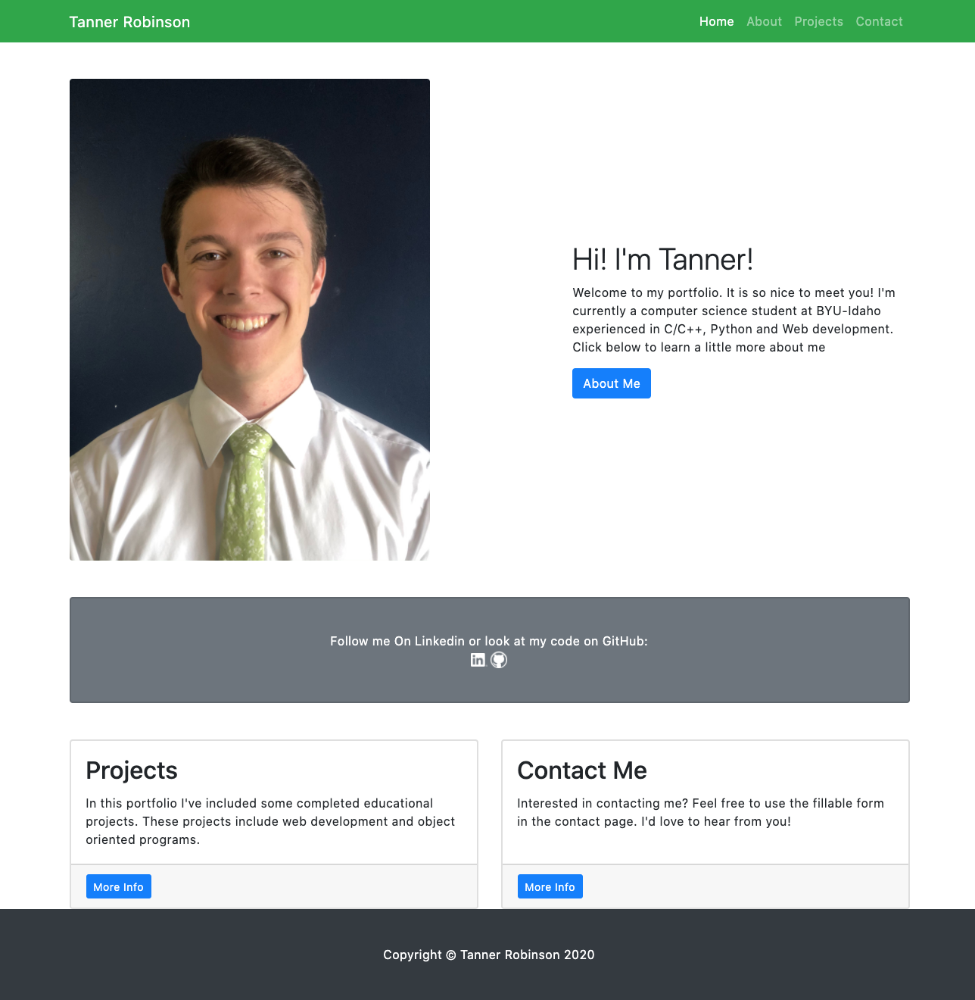
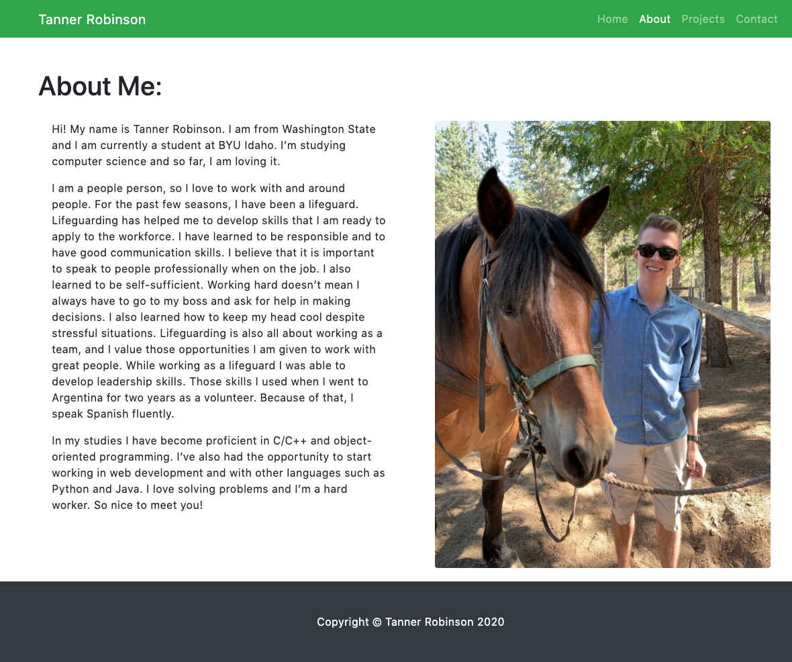
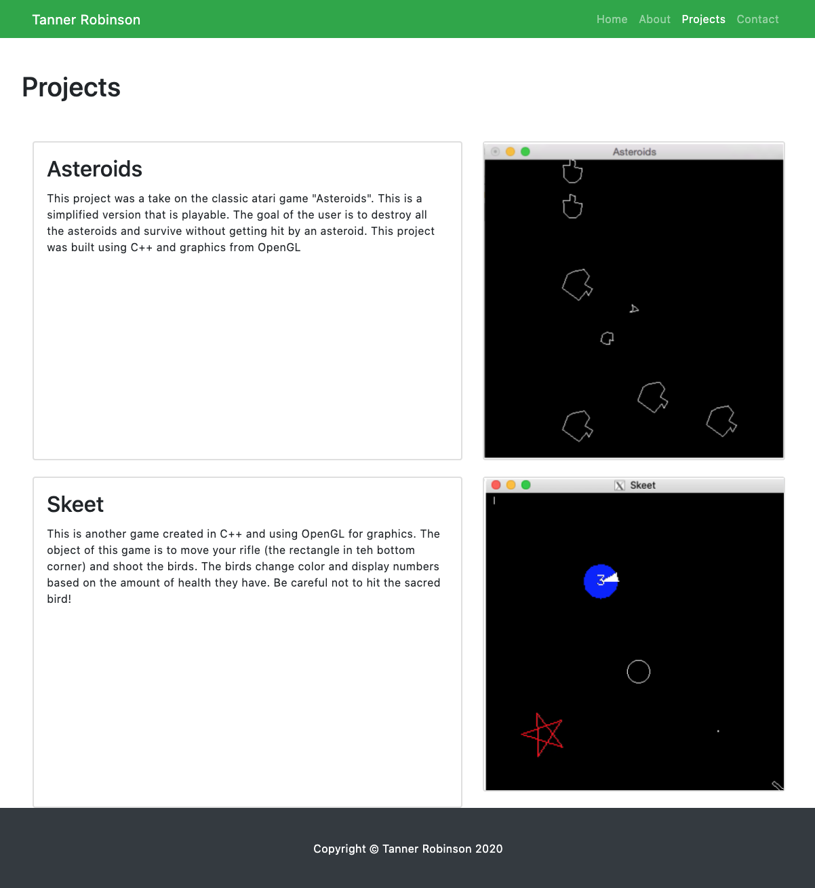
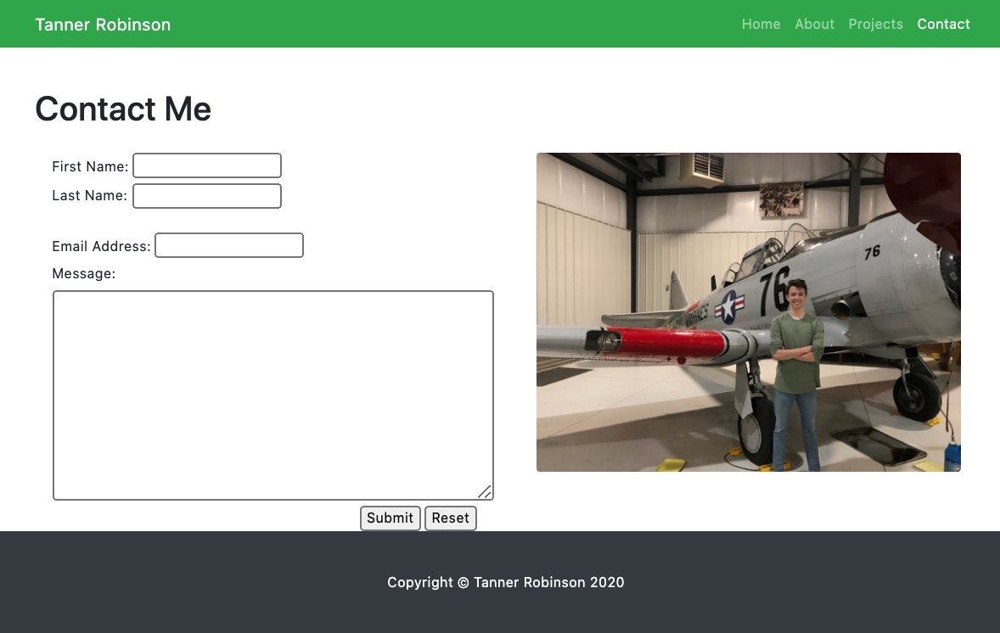

# Personal Portfolio Website #
## Description: ##
This is a website to help me find a job. When I turn in my resume, I can also turn in this website to introduce myself. This website include four pages, a Home page, an about page, a projects page, and a contact me page. These pages work together to help a potential employer get to know me.

## Django Setup ##
To install django, first a developer must have python and pip installed. Once those are installed, type in the command ```python -m pip install Django```. This command will automatically install the files needed to run Django on your computer.

Next you will need to start a new app. Inside your terminal program, go to a directory (or make one) which you'd like to use to hold your website. Then type the command ```django-admin startproject *site name*``` (Site name = name of project). This will create a django directory inside of your chosen directory. After that you need to type ```python manage.py startapp *site name*``` to start to create your homepage.

Next, creaete your website. Add your pages into a folder entiltled "templates" inside the main directory of your django project. Then go into the settings file of your initial django file. In the part labled DIRS[], type in the command ```os.path.join(BASE_DIR,'templates')``` inside the brackets. This will connect your templates file to django so you can run your site. To see more information, please go to [this youtube video](https://www.youtube.com/watch?v=h7rvyDK70FA&t=3s). The developer explains it in a more visual way.

## Using my Website ##
Django comes with a built-in server to allow you to view websites. If you'd like to see my website simply download the avaliable files and save them to a folder on your computer. Open your terminal program and using the `cd` command, travel to the directory where the website is downloaded. Once there run the command ```python manage.py runserver```. This will open up a server so you can view the website. Once ther server is open, open your webrowser to http://127.0.0.1:8000/portfolio/ and view the website.

## Photos of Website

Home page:


About Page:


Projects Page:


Contact Page:


## Useful Websites ##

* [Youtube Tutorial 1](https://www.youtube.com/watch?v=h7rvyDK70FA&t=3s)
* [Youtube Tutorial 2](https://www.youtube.com/watch?v=ovql0Ui3n_I)
* [Django Start New Project Doc](https://docs.djangoproject.com/en/3.1/intro/tutorial01/)
* [Bootstrap Info](https://getbootstrap.com/docs/4.0/utilities/colors/)